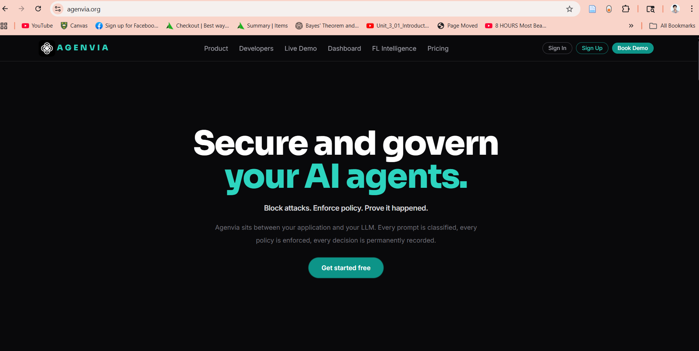
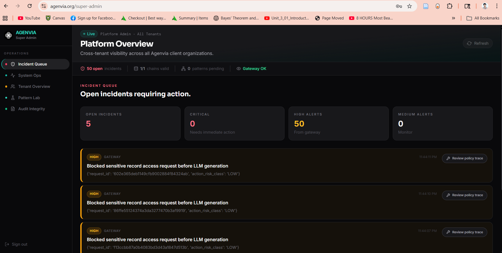
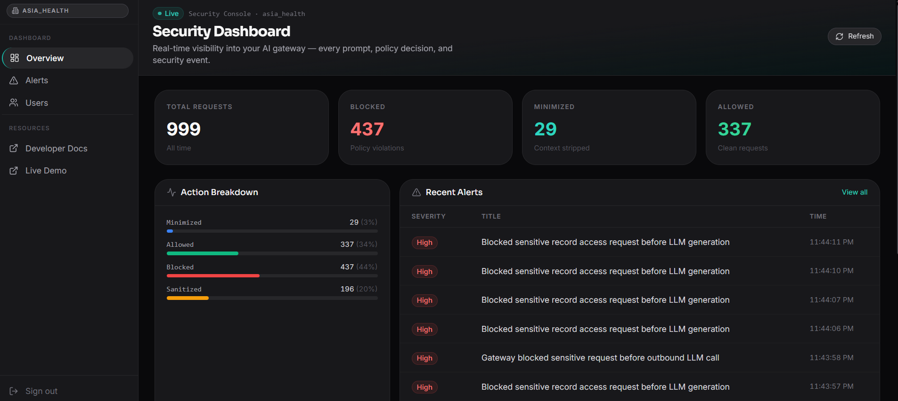

<div align="center">


# Agenvia Web

**The governance dashboard for your AI agents.**

Real-time visibility into every prompt, policy decision, and security event — across all tenants, all agents, all time.

[](https://agenvia.org)
[](https://www.linkedin.com/posts/nazmul-hossen-699765205_agent-security-activity-7445680048428314639-ksSH)
[](https://nextjs.org)
[](https://www.typescriptlang.org)
[](https://tailwindcss.com)

</div>

---



> **Block attacks. Enforce policy. Prove it happened.**
> Agenvia sits between your application and your LLM. Every prompt is classified, every policy is enforced, every decision is permanently recorded.

<div align="center">

**[▶ Watch the demo on LinkedIn](https://www.linkedin.com/posts/nazmul-hossen-699765205_agent-security-activity-7445680048428314639-ksSH)**

</div>

---

## Screenshots

### Platform Overview — Cross-tenant Incident Command



Super-admin view across all Agenvia client organizations. See open incidents requiring action, critical alerts, and pending approvals at a glance — with one-click access to the full policy trace for every blocked request.

---

### Security Dashboard — Per-tenant Real-time Visibility



Every prompt, every policy decision, every security event — live. Action breakdown by outcome (`blocked`, `minimized`, `allowed`, `sanitized`), recent alert feed with severity and timestamp, and a running total that resets with each deployment window.

---

## Features

| Feature | Description |
|---------|-------------|
| **Incident queue** | Open incidents ranked by severity. Each links directly to the full policy trace and audit record. |
| **Security dashboard** | Real-time request totals, action breakdown chart, and recent alert feed per tenant. |
| **Tenant overview** | Cross-tenant visibility for platform operators — no context switching required. |
| **Pattern lab** | Inspect federated learning pattern candidates, promotion status, and false-positive rates. |
| **Audit integrity** | Tamper-evident audit log viewer. Every gateway decision is permanently recorded. |
| **User & agent management** | Register users with domain clearances and platform roles. Register agents with allowed tools. |
| **Policy editor** | Live policy simulation before activation. Version-controlled ruleset with instant rollback. |
| **Human approval workflow** | Review and action pending tool-execution approvals directly from the dashboard. |

---

## Ecosystem

| | Description |
|-|-------------|
| [agenvia-python](https://github.com/agenvia/agenvia-python) | Python SDK — `pip install agenvia` |
| **agenvia-web** ← you are here | Dashboard (Next.js + TypeScript) |
| [API Docs](https://agenvia.org/developers) | REST API reference & integration guides |

---

## Tech Stack

- **Framework** — Next.js 15 (App Router)
- **Language** — TypeScript
- **Styling** — Tailwind CSS
- **Components** — Primer React
- **Deployment** — Vercel

---

## Getting Started

### Prerequisites

- Node.js 18+
- An Agenvia API key — get one at [agenvia.org](https://agenvia.org)

### Install

```bash
git clone https://github.com/agenvia/agenvia-web
cd agenvia-web
npm install
```

### Configure

```bash
cp .env.example .env.local
# Set NEXT_PUBLIC_API_URL to your agenvia-api base URL
```

### Run

```bash
npm run dev
# Open http://localhost:3000
```

### Build for production

```bash
npm run build
npm start
```

---

## Deploy on Vercel

[](https://vercel.com/new/clone?repository-url=https://github.com/agenvia/agenvia-web)

Set `NEXT_PUBLIC_API_URL` in your Vercel project environment variables to point to your deployed `agenvia-api` instance.

---

## License

MIT
